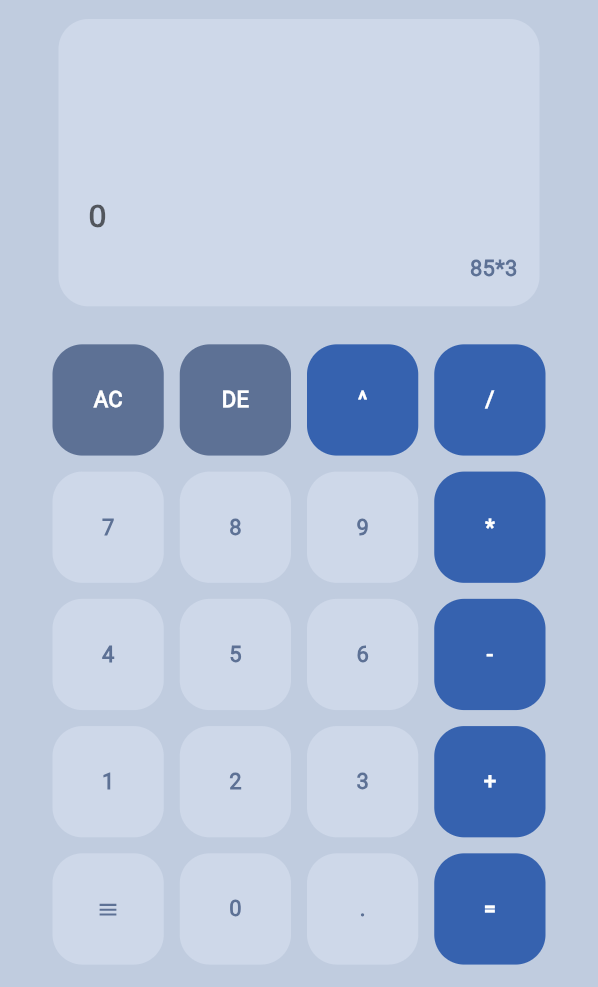
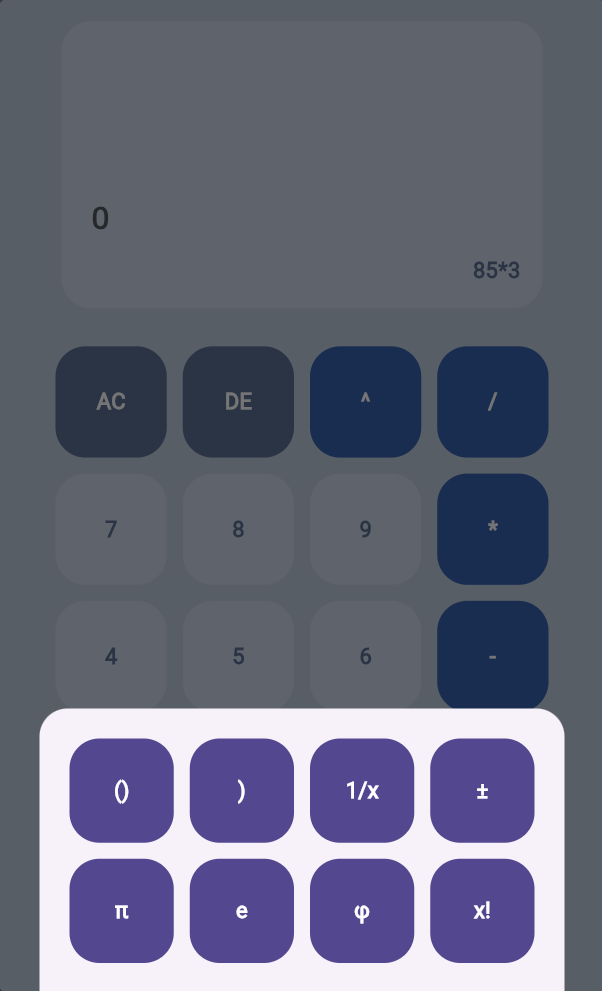

# Calculadora

> [!IMPORTANT]
> Este proyecto está en desarrollo y tiene problemas en la funcionalidad de algunas operaciones.

## Características

- ✅ Calculo de operaciones básicas
  - suma, resta, división, multiplicación, potencia
- ❌ Calculo de operaciones trigonométricas
  - seno, coseno, tangente, secante, cosecante, tangente

> [!NOTE]
> Se podrían realizar cambios en las características del proyecto, en este momento solo se menciona lo que se planea realizar con él.

## Instalación

1. Clona este repositorio:

```bash
git clone https://github.com/Manuel-Alonso-AG/Calculadora-funcional.git
```

2. Instala las dependencias:

- popover
- provider
- flutter_staggered_grid_view

```bash
flutter pub get
```

3. Ejecuta la app:

```bash
flutter run
```

## Capturas de pantalla




## Progreso

Se realizo el apartado lógico donde se realiza la operacion ingresada, se utilizó un árbol que separa los operadores de los operandos y se recorre realizando las operaciones.

- Uso de un árbol binario
- Convertir la expresión en posfija
- Uso de la jerarquía de las operaciones

## Problemas del desarrollo

El cursor del campo de texto que muestra la operación matemática no se muestra.

## Futura implementación

Implementacion de constantes matematicas como pi, phi, e
Uso de las opciones SIFT y ALPHA de una calculadora científica. Además del uso de funciones trigonométricas.
