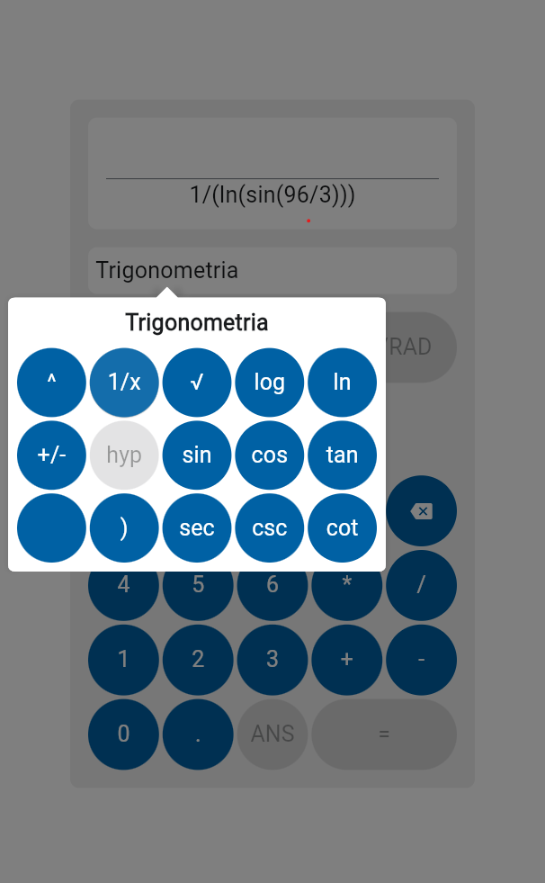

# Calculadora

A new Flutter project.

> [!IMPORTANT]
> Este proyecto esta en desarrollo y no hay un funcionamiento de la aplicacion en este momento.

## Características

- ❎ Calculo de operaciones basicas
  - suma, resta, division, multiplicacion, potencia, raiz
- ❎ Calculo de operaciones trigonometricas
  - seno, coseno, tangente, secante, cosecante, tangente

> [!NOTE]
> Se podrian realizar cambios en las caracteristicas del proyecto, en este momento solo se mensiona lo que se planea realizar con el.

## Instalación

1. Clona este repositorio:

```bash
git clone https://github.com/Manuel-Alonso-AG/Calculadora-funcional.git
```

2. Instala las dependencias:

- popover
- provider
- flutter_staggered_grid_view

```bash
flutter pub get
```

3. Ejecuta la app:

```bash
flutter run
```

## Capturas de pantalla



## Progreso

Se realizó la interfaz de la calculadora, con el uso de mostrar la operación ingresada por el usuario de la mayoría de las funciones de una calculadora científica.

- Mostrar números
- Mostrar operaciones básicas
- Mostrar funciones trigonométricas
- Desplazar el cursor del campo de texto

## Problemas del desarrollo

Hay problemas en la forma en la que se construyó la interfaz; la legibilidad no es tan clara, pero funcional.

El cursor del campo de texto que muestra la operación matemática no se muestra.

- lib/main.dart (line 192)

```dart
    Column(
        children: [
            const Text('Operación', style: TextStyle(fontSize: 20)),
            const SizedBox(height: 10),
            TextField(
                controller: context.watch<OperationsProvider>().controller,
                cursorColor: Colors.black,
                autofocus: true,
                showCursor: true,
                // Como hago que se vea el cursor siempre?
                readOnly: false,
                inputFormatters: [
                    FilteringTextInputFormatter.deny(RegExp('.*')),
                ],
                textAlign: TextAlign.right,
                style: const TextStyle(fontSize: 30),
                decoration: const InputDecoration(
                    border: InputBorder.none,
                    hintText: '0',
                ),
            ),
        ],
    ),
```

## Futura implementacion

Uso de las opciones SIFT y ALPHA de una calculadora científica. Además del uso de funciones hiperbólicas.

Implementación de la lógica que resuelva y muestre el resultado de la operación ingresada.
